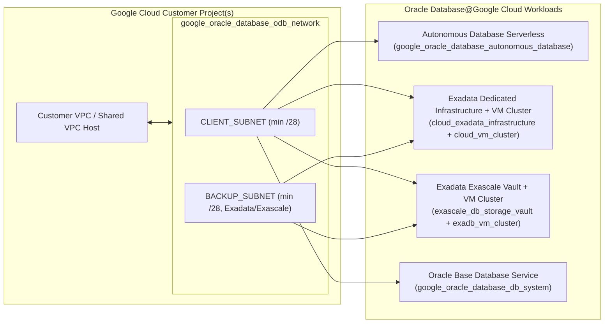

# Oracle Database@Google Cloud Onboarding & Infrastructure Agent

An interactive, production-ready onboarding agent and Terraform code generator for **Oracle Database@Google Cloud (ODB@GCP)**. Run the guided 5-phase discovery workflow via **CLI** (`Typer` + `Rich`) or **Web UI** (`Streamlit`) to validate network/CIDR topologies, run Google Cloud pre-flight checks, and generate modular Terraform (`hashicorp/google >= 7.0.0`) + CI/CD pipelines.

---

## 1. Supported Architecture & Workloads



### Supported Services
1. **ODB Networking Layer**:
   - **Standalone VPC** or **Shared VPC** (Host Project + Service Project separation).
   - `google_oracle_database_odb_network` bound to a specific Google Cloud region and `gcp_oracle_zone` (e.g., `us-east4-b-r1`).
   - `google_oracle_database_odb_subnet` for `CLIENT_SUBNET` (minimum `/28`) and conditional `BACKUP_SUBNET` (automatically required for Exadata Dedicated and Exascale).
   - Built-in **IPv4 CIDR `/28` prefix validation** and **pairwise CIDR overlap detection** across VPC CIDR, Client Subnet CIDR, and Backup Subnet CIDR.
2. **Database Workloads**:
   - **Autonomous Database Serverless (`adb`)**: OLTP, DW, APEX, or AJD on Oracle `23ai` or `19c`, ECPU auto-scaling, mTLS enforcement, and License Included / BYOL.
   - **Exadata Database Service on Dedicated Infrastructure (`exadata_dedicated`)**: `Exadata.X9M` / `Exadata.X11M` shapes, configurable compute/storage server counts, and Cloud VM Cluster allocation.
   - **Exadata Database Service on Exascale Infrastructure (`exascale`)**: Exascale Storage Vault (High-Capacity Storage GB + Smart Flash Cache %) and Exascale VM Cluster (`SMART_STORAGE` / `BLOCK_STORAGE`).
   - **Oracle Base Database Service (`basedb`)**: Single-node or 2-node RAC DB Systems (`VM.Standard.E4.Flex`, `VM.Standard3.Flex`) with `ASM` or `LVM` storage management.
3. **CI/CD & Remote State**:
   - Remote GCS Terraform state backend (`backend "gcs"`).
   - Pipeline manifests for **GitHub Actions**, **GitLab CI**, and **Google Cloud Build** using keyless **Workload Identity Federation (WIF)**.

---

## 2. Repository Structure

```text
oracle-google-onboarding-agent/
├── README.md
├── Dockerfile
├── docker-compose.yml
├── requirements.txt
├── pyproject.toml
├── agent/
│   ├── __init__.py
│   ├── cli.py                 # Typer + Rich CLI interactive interview & preflight runner
│   ├── web.py                 # Streamlit 5-phase interactive Web UI
│   ├── state.py               # Pydantic v2 models & 5-phase discovery state machine
│   ├── validators.py          # CIDR overlap, /28 bounds, GCP & Oracle naming validators
│   ├── preflight.py           # GCP APIs, Marketplace Entitlement & IAM verification
│   └── generator.py           # Jinja2 template rendering & safe bundle exporter
├── templates/
│   ├── terraform/
│   │   ├── main.tf.j2
│   │   ├── variables.tf.j2
│   │   ├── outputs.tf.j2
│   │   ├── versions.tf.j2
│   │   ├── terraform.tfvars.j2
│   │   └── modules/
│   │       ├── networking/
│   │       │   ├── main.tf.j2
│   │       │   ├── variables.tf.j2
│   │       │   └── outputs.tf.j2
│   │       ├── adb/
│   │       │   └── main.tf.j2
│   │       ├── exadata_dedicated/
│   │       │   └── main.tf.j2
│   │       ├── exascale/
│   │       │   └── main.tf.j2
│   │       └── basedb/
│   │           └── main.tf.j2
│   └── pipelines/
│       ├── github-actions.yml.j2
│       ├── gitlab-ci.yml.j2
│       └── cloudbuild.yaml.j2
├── .github/
│   └── workflows/
│       └── sample-deploy.yml
└── tests/
    ├── test_validators.py
    └── test_generator.py
```

---

## 3. Quick Start

### Option A: Local Virtual Environment (Recommended)

```bash
# 1. Create and activate a Python 3.11+ virtual environment
python3 -m venv .venv
source .venv/bin/activate

# 2. Install dependencies
.venv/bin/pip install --upgrade pip
.venv/bin/pip install -r requirements.txt
.venv/bin/pip install -e .
```

#### Run the Interactive CLI Interview
```bash
python -m agent.cli interview
# Or using the installed console script:
odb-agent interview
```

#### Run Live or Simulated GCP Pre-Flight Verification
```bash
# Simulated dry-run (no active gcloud credentials required)
python -m agent.cli preflight --project-id my-odb-project-01 --dry-run

# Live verification against your Google Cloud project
python -m agent.cli preflight --project-id my-odb-project-01 --host-project-id my-host-vpc-01
```

#### Launch the Interactive Streamlit Web UI
```bash
streamlit run agent/web.py --server.address=127.0.0.1 --server.port=8501
```

---

### Option B: Docker & Docker Compose

```bash
# Start the Web UI on http://127.0.0.1:8501
docker compose up --build odb-onboarding-web

# Or run the interactive CLI inside Docker (exports to ./output)
docker compose --profile cli run --rm odb-onboarding-cli
```

---

## 4. Security & Operational Best Practices

- **No Hardcoded Secrets**: Database administrator passwords (`var.db_admin_password`) are declared with `sensitive = true` in `variables.tf` and are **never** written to `terraform.tfvars`. Inject passwords at deployment time via `TF_VAR_db_admin_password` from Google Cloud Secret Manager or CI/CD encrypted secrets.
- **Keyless CI/CD Authentication**: All generated pipelines (`.github/workflows/deploy-odb.yml`, `.gitlab-ci.yml`, `cloudbuild.yaml`) authenticate using **Google Cloud Workload Identity Federation (WIF)** rather than long-lived service account JSON keys.
- **Strict Input Validation**: Every project ID, subnet CIDR, resource identifier, Oracle DB name, and SSH public key is validated via strict allow-list regular expressions and Python's `ipaddress` module before rendering.

---

## 5. Running the Test Suite

```bash
.venv/bin/pytest -v
```
